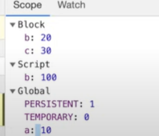

# Basics


## 1️⃣ EXECUTION CONTEXT & CALL STACK

### What is Execution Context?

```
╔══════════════════════════════════════════════════════╗
║              EXECUTION CONTEXT                        ║
║  (The environment where JavaScript code executes)    ║
╠══════════════════════════════════════════════════════╣
║                                                      ║
║  TWO PHASES:                                         ║
║  ┌────────────────────────────────────────────┐     ║
║  │  PHASE 1: MEMORY CREATION                  │     ║
║  │  - Allocates memory to variables/functions │     ║
║  │  - Variables → undefined (initial value)   │     ║
║  │  - Functions → store entire code           │     ║
║  └────────────────────────────────────────────┘     ║
║              ↓                                       ║
║  ┌────────────────────────────────────────────┐     ║
║  │  PHASE 2: CODE EXECUTION                   │     ║
║  │  - Assigns actual values to variables      │     ║
║  │  - Executes code line by line              │     ║
║  │  - Functions create NEW execution context  │     ║
║  └────────────────────────────────────────────┘     ║
║                                                      ║
╚══════════════════════════════════════════════════════╝
```

### Example: Memory Creation Phase

```javascript
var n = 10;
function square(num) {
  return num * num;
}
```

```
MEMORY ALLOCATION (Before Execution):

┌────────────────────────────────────────────────┐
│  Global Execution Context - Memory Phase       │
├────────────────────────────────────────────────┤
│                                                │
│   ┌─────────┬────────────────────────────┐    │
│   │ Variable│ Memory Value                │    │
│   ├─────────┼────────────────────────────┤    │
│   │ n       │ undefined  📦              │    │
│   │ square  │ entire function code 💾    │    │
│   │         │ { return num * num; }      │    │
│   └─────────┴────────────────────────────┘    │
│                                                │
└────────────────────────────────────────────────┘
```

### Code Execution Phase

```
EXECUTION (After Memory Phase):

┌────────────────────────────────────────────────┐
│  Global Execution Context - Execution Phase    │
├────────────────────────────────────────────────┤
│                                                │
│   var n = 10;          → n becomes 10          │
│   function square() ✓  → already stored        │
│   var result = square(n);  → executes, returns │
│   console.log(result);     → prints 100        │
│                                                │
│   Final Memory:                                │
│   ┌─────────┬──────────┐                      │
│   │ n       │ 10       │                      │
│   │ result  │ 100      │                      │
│   └─────────┴──────────┘                      │
│                                                │
└────────────────────────────────────────────────┘
```

### CALL STACK - Visual Flow

```
CODE:
function calculate() {
  multiply();
}
function multiply() {
  console.log("Done");
}
calculate();
```

```
CALL STACK DYNAMICS (LIFO - Last In First Out):

STAGE 1: Program Starts
┌─────────────────┐
│    Global EC    │  ← Pushed first (bottom)
└─────────────────┘

STAGE 2: calculate() Called
┌─────────────────┐  ← PUSHED ✅
│  calculate EC   │
├─────────────────┤
│    Global EC    │
└─────────────────┘

STAGE 3: multiply() Called
┌─────────────────┐  ← PUSHED ✅
│   multiply EC   │
├─────────────────┤
│  calculate EC   │
├─────────────────┤
│    Global EC    │
└─────────────────┘

STAGE 4: multiply() Finishes
┌─────────────────┐
│  calculate EC   │  ← POPPED ❌ (multiply done)
├─────────────────┤
│    Global EC    │
└─────────────────┘

STAGE 5: calculate() Finishes
┌─────────────────┐
│    Global EC    │  ← POPPED ❌ (calculate done)
└─────────────────┘

STAGE 6: Program Ends
(Global EC popped, program complete)
```

### Complete Execution Timeline

```javascript
var num1 = 5;
var num2 = 3;

function square(n) {
  return n * n;
}

var square1 = square(num1);  // Creates new EC
var square2 = square(num2);  // Creates new EC
```

```
TIMELINE:

Step 1: Global EC Created
┌──────────────────────────────────┐
│  Global EC: {num1: undefined}    │
│             {num2: undefined}    │
│             {square: function}   │
└──────────────────────────────────┘
     ↓
Step 2: Execute assignments
┌──────────────────────────────────┐
│  num1 = 5                        │
│  num2 = 3                        │
└──────────────────────────────────┘
     ↓
Step 3: square(num1) called
┌──────────────────────────────────┐
│  Global EC                       │
│  ┌────────────────────────────┐  │
│  │ square EC (n=5)            │  │  ← NEW EC PUSHED
│  │ return 5*5 = 25            │  │
│  └────────────────────────────┘  │
└──────────────────────────────────┘
     ↓
Step 4: Returns 25, square EC destroyed
┌──────────────────────────────────┐
│  Global EC                       │
│  square1 = 25                    │
│  square EC POPPED ❌              │
└──────────────────────────────────┘
     ↓
Step 5: square(num2) called
┌──────────────────────────────────┐
│  Global EC                       │
│  ┌────────────────────────────┐  │
│  │ square EC (n=3)            │  │  ← ANOTHER NEW EC
│  │ return 3*3 = 9             │  │
│  └────────────────────────────┘  │
└──────────────────────────────────┘
     ↓
Step 6: Returns 9, program ends
```

***

## 2️⃣ HOISTING

### What is Hoisting?

```
╔══════════════════════════════════════════════════════╗
║                    HOISTING                          ║
║                                                      ║
║  "Moving declarations to the top during memory      ║
║   creation phase (before code execution)"            ║
╚══════════════════════════════════════════════════════╝
```

### Visual Timeline of Hoisting

```javascript
// Your code (what you write):
console.log(name);  // undefined
var name = "Akshay";

console.log(greet());  // "Hello"
function greet() {
  return "Hello";
}
```

```
WHAT JAVASCRIPT DOES INTERNALLY:

┌────────────────────────────────────────────────────┐
│  BEFORE EXECUTION (Memory Creation Phase)          │
├────────────────────────────────────────────────────┤
│                                                    │
│  Hoisting Happens Here:                            │
│  ┌────────────────────────────────────────┐       │
│  │ var name = undefined;  ← hoisted       │       │
│  │ function greet() {                     │       │
│  │   return "Hello";                      │       │
│  │ }  ← entire function hoisted           │       │
│  └────────────────────────────────────────┘       │
│                                                    │
│  Memory State:                                     │
│  ┌──────────┬──────────────┐                      │
│  │ name     │ undefined    │                      │
│  │ greet    │ function ✓   │                      │
│  └──────────┴──────────────┘                      │
│                                                    │
└────────────────────────────────────────────────────┘
                    ↓
┌────────────────────────────────────────────────────┐
│  DURING EXECUTION (Code Execution Phase)           │
├────────────────────────────────────────────────────┤
│                                                    │
│  console.log(name);     → prints: undefined        │
│  name = "Akshay";       → now assigned             │
│  console.log(greet());  → prints: "Hello"          │
│                                                    │
└────────────────────────────────────────────────────┘
```

### Hoisting Behavior by Type

```
┌────────────────────────────────────────────────────┐
│  HOISTING BEHAVIOR COMPARISON                      │
├──────────────┬──────────────┬──────────────────────┤
│    Type      │   Hoisted?   │   Value Before       │
│              │              │   Assignment         │
├──────────────┼──────────────┼──────────────────────┤
│  var x       │   ✅ YES     │   undefined          │
│              │              │   (can access)       │
├──────────────┼──────────────┼──────────────────────┤
│  function()  │   ✅ YES     │   entire function    │
│              │              │   (can call)         │
├──────────────┼──────────────┼──────────────────────┤
│  let x       │   ❌ NO      │   ReferenceError     │
│              │              │   (cannot access)    │
├──────────────┼──────────────┼──────────────────────┤
│  const x     │   ❌ NO      │   ReferenceError     │
│              │              │   (cannot access)    │
└──────────────┴──────────────┴──────────────────────┘
```

### Example with var vs let vs const

```javascript
// VAR (hoisted)
console.log(a);  // undefined ✅
var a = 10;
console.log(a);  // 10

// LET (NOT hoisted)
console.log(b);  // ReferenceError ❌
let b = 20;

// CONST (NOT hoisted)
console.log(c);  // ReferenceError ❌
const c = 30;
```

```
VISUAL COMPARISON:

VAR:
┌────────────────────────────────┐
│ Memory Phase: a = undefined    │
│ Execution: console.log(a)      │
│          → prints: undefined   │
│          a = 10                │
└────────────────────────────────┘

LET:
┌────────────────────────────────┐
│ Memory Phase: NOT allocated    │
│ Execution: console.log(b)      │
│          → ReferenceError ❌   │
│          (Temporal Dead Zone)  │
└────────────────────────────────┘

FUNCTION (fully hoisted):
┌────────────────────────────────┐
│ Memory Phase:                  │
│   function greet() {           │
│     return "Hello";            │
│   }  ← whole function stored   │
│ Execution:                     │
│   greet() → works! ✅          │
└────────────────────────────────┘
```

***

## 3️⃣ HOW FUNCTIONS WORK IN JS

### Function Declaration vs Function Expression

```javascript
// FUNCTION DECLARATION (hoisted)
function sayHi() {
  return "Hi";
}
sayHi();  // ✅ Works - function is available

// FUNCTION EXPRESSION (not hoisted)
var sayHello = function() {
  return "Hello";
};
sayHello();  // ❌ Error if called before definition
```

```
VISUAL COMPARISON:

DECLARATION:
┌────────────────────────────────┐
│ Memory Phase:                  │
│   sayHi → entire function ✓    │
│ Execution:                     │
│   sayHi() → Can call ✅        │
└────────────────────────────────┘

EXPRESSION:
┌────────────────────────────────┐
│ Memory Phase:                  │
│   sayHello → undefined         │
│ Execution:                     │
│   sayHello = function() {...}  │
│   sayHello() → Before this:    │
│              undefined() ❌    │
│              After this: ✅    │
└────────────────────────────────┘
```

### Each Function Call Creates NEW Execution Context

```javascript
function square(n) {
  return n * n;
}

var result1 = square(5);  // Call 1
var result2 = square(3);  // Call 2
```

```
VISUAL: Multiple Function Calls

CALL 1: square(5)
┌────────────────────────────────┐
│  Global EC                     │
│  ┌──────────────────────────┐  │
│  │ square EC #1             │  │
│  │ n = 5                    │  │  ← NEW context
│  │ return 5 * 5 = 25        │  │
│  └──────────────────────────┘  │
└────────────────────────────────┘
         ↓ Returns 25
         ↓
┌────────────────────────────────┐
│  Global EC                     │
│  result1 = 25                  │
│  square EC #1 POPPED ❌         │
└────────────────────────────────┘

CALL 2: square(3)
┌────────────────────────────────┐
│  Global EC                     │
│  ┌──────────────────────────┐  │
│  │ square EC #2             │  │
│  │ n = 3                    │  │  ← NEW context (independent!)
│  │ return 3 * 3 = 9         │  │
│  └──────────────────────────┘  │
└────────────────────────────────┘
         ↓ Returns 9
         ↓
┌────────────────────────────────┐
│  Global EC                     │
│  result2 = 9                   │
│  square EC #2 POPPED ❌         │
└────────────────────────────────┘
```

### Key Points Visualized

```
╔══════════════════════════════════════════════════════╗
║  HOW FUNCTIONS WORK - KEY POINTS                     ║
╠══════════════════════════════════════════════════════╣
║                                                      ║
║  1. Each function call = NEW execution context      ║
║     ┌──────────────┐  ┌──────────────┐              ║
║     │  EC #1       │  │  EC #2       │              ║
║     │  Independent │  │  Independent │              ║
║     └──────────────┘  └──────────────┘              ║
║                                                      ║
║  2. Each EC has its own memory space                ║
║     EC #1: {n: 5}  ≠  EC #2: {n: 3}                 ║
║                                                      ║
║  3. After function returns, EC is destroyed         ║
║     EC → Return value → Pop from stack ❌           │
║                                                      ║
║  4. Return value goes to calling context            ║
║     result = square(5)  → result = 25               │
║                                                      ║
╚══════════════════════════════════════════════════════╝
```

***

## 4️⃣ SCOPE CHAIN & LEXICAL ENVIRONMENT

### Lexical Environment Formula

```
╔══════════════════════════════════════════════════════╗
║  LEXICAL ENVIRONMENT FORMULA                         ║
║                                                      ║
║  LE = Local Memory + Lexical Env of Parent          ║
║                                                      ║
║  Translation: "My memory + reference to parent's    ║
║               lexical environment"                   ║
╚══════════════════════════════════════════════════════╝
```

### Visual Scope Chain

```javascript
function outer() {
  var x = 10;
  
  function inner() {
    var y = 20;
    console.log(x);  // Can access x from outer!
    console.log(y);  // Can access own y
  }
  
  inner();
}

outer();
```

```
SCOPE CHAIN VISUALIZATION:

┌────────────────────────────────────────────────────┐
│  GLOBAL SCOPE                                       │
│  Memory: {}                                         │
│  Outer LE: null (no parent)                        │
└────────────────────────────────────────────────────┘
                    ↑ (parent reference)
┌────────────────────────────────────────────────────┐
│  outer() FUNCTION SCOPE                            │
│  Memory: {x: 10}                                   │
│  Outer LE: → GLOBAL                                │
│                                                  │
│  ┌──────────────────────────────────────────┐    │
│  │  inner() FUNCTION SCOPE                   │    │
│  │  Memory: {y: 20}                          │    │
│  │  Outer LE: → outer()                      │    │
│  │                                          │    │
│  │  When inner() needs x:                   │    │
│  │    1. Check inner's memory → NOT FOUND    │    │
│  │    2. Go to outer() → FOUND x = 10 ✅     │    │
│  └──────────────────────────────────────────┘    │
└────────────────────────────────────────────────────┘
```

### Scope Chain Search Process

```javascript
var a = 10;

function outer() {
  var a = 20;
  
  function inner() {
    var a = 30;
    console.log(a);  // Which 'a'?
  }
  
  inner();
  console.log(a);  // Which 'a'?
}

outer();
console.log(a);  // Which 'a'?
```

```
SEARCH PROCESS FOR 'a':

inner() looks for 'a':
┌────────────────────────────────────────┐
│ Step 1: inner's local memory           │
│   Found: a = 30 ✅                     │
│   RESULT: 30 (stops searching)         │
└────────────────────────────────────────┘

outer() looks for 'a':
┌────────────────────────────────────────┐
│ Step 1: outer's local memory           │
│   Found: a = 20 ✅                     │
│   RESULT: 20 (stops searching)         │
└────────────────────────────────────────┘

Global looks for 'a':
┌────────────────────────────────────────┐
│ Step 1: Global memory                  │
│   Found: a = 10 ✅                     │
│   RESULT: 10 (stops searching)         │
└────────────────────────────────────────┘
```

### OUTPUT:
```
inner() → 30
outer() → 20
Global → 10
```

### Nested Scopes Example

```javascript
function a() {
  var x = 10;
  
  function b() {
    var y = 20;
    
    function c() {
      var z = 30;
      console.log(x);  // Can access x from 'a'
      console.log(y);  // Can access y from 'b'
      console.log(z);  // Can access own z
    }
    
    c();
  }
  
  b();
}

a();
```

```
THREE LEVELS OF NESTING:

┌──────────────────────────────────────────────────┐
│  FUNCTION a()                                     │
│  Memory: {x: 10}                                  │
│  Parent: → GLOBAL                                │
│                                               │
│  ┌──────────────────────────────────────────┐  │
│  │  FUNCTION b()                             │  │
│  │  Memory: {y: 20}                          │  │
│  │  Parent: → a()                            │  │
│  │                                         │  │
│  │  ┌────────────────────────────────────┐ │  │
│  │  │  FUNCTION c()                       │ │  │
│  │  │  Memory: {z: 30}                    │ │  │
│  │  │  Parent: → b()                      │ │  │
│  │  │                                   │ │  │
│  │  │  c() can access:                  │ │  │
│  │  │    - z (own) ✅                    │ │  │
│  │  │    - y (parent b) ✅               │ │  │
│  │  │    - x (parent a) ✅               │ │  │
│  │  └────────────────────────────────────┘ │  │
│  └──────────────────────────────────────────┘  │
└──────────────────────────────────────────────────┘

SCOPE CHAIN: c → b → a → Global
```

***

## 5️⃣ LET & CONST

### Block Scope Visualization

```javascript
if (true) {
  let a = 21;
  const b = 212;
  var c = 8;
}

console.log(a);  // ❌ ReferenceError
console.log(b);  // ❌ ReferenceError
console.log(c);  // ✅ 8
```

```
BLOCK SCOPE VISUALIZATION:

┌──────────────────────────────────────────────────┐
│  if (true) {  ← BLOCK START                      │
│                                               │
│    ┌────────────────────────────────────────┐  │
│    │  BLOCK SCOPE                           │  │
│    │  ┌──────────────────────────────────┐  │  │
│    │  │ let a = 21   ← INSIDE ONLY       │  │  │
│    │  │ const b = 212 ← INSIDE ONLY      │  │  │
│    │  │ var c = 8    ← CAN ESCAPE!       │  │  │
│    │  └──────────────────────────────────┘  │  │
│    └────────────────────────────────────────┘  │
│                                               │
│  }  ← BLOCK END                                │
│                                               │
│  console.log(a);  ❌ OUTSIDE - ERROR!          │
│  console.log(b);  ❌ OUTSIDE - ERROR!          │
│  console.log(c);  ✅ OUTSIDE - WORKS!          │
│                                               │
└──────────────────────────────────────────────────┘

VAR escapes the block (function scoped)
LET/CONST stay inside the block (block scoped)
```

### LET vs CONST Comparison

```
┌──────────────────────────────────────────────────┐
│  LET (can reassign)                              │
├──────────────────────────────────────────────────┤
│  let x = 10;                                     │
│    ↓                                             │
│  x = 20;  → ✅ Works (value changed)             │
│    ↓                                             │
│  x = 30;  → ✅ Works (value changed again)       │
│    ↓                                             │
│  Final: x = 30                                   │
└──────────────────────────────────────────────────┘

┌──────────────────────────────────────────────────┐
│  CONST (cannot reassign)                         │
├──────────────────────────────────────────────────┤
│  const y = 10;                                   │
│    ↓                                             │
│  y = 20;  → ❌ TypeError!                        │
│           (Assignment to constant)               │
│                                                  │
│  MUST initialize immediately:                    │
│  const z;  → ❌ Error!                           │
│  const z = 10;  → ✅ Works                       │
└──────────────────────────────────────────────────┘
```

### Object with const (Tricky Part!)

```javascript
const person = { name: "John" };
person.name = "Jane";  // ✅ Works
person = {};  // ❌ Error
```

```
CONST WITH OBJECTS:

const person = { name: "John" };
     ↓
┌────────────────────────────────────┐
│  person → { name: "John" }         │
│  (reference is fixed)              │
└────────────────────────────────────┘

person.name = "Jane";  ✅ Works
     ↓
┌────────────────────────────────────┐
│  person → { name: "Jane" }         │
│  (content changed, reference same) │
└────────────────────────────────────┘

person = {};  ❌ Error
     ↓
┌────────────────────────────────────┐
│  Cannot change REFERENCE!          │
│  person still points to original   │
│  (would create new object)         │
└────────────────────────────────────┘
```

### Block vs Function Scope

```javascript
function test() {
  if (true) {
    var x = 10;
    let y = 20;
  }
  
  console.log(x);  // ✅ 10 (var is function scoped)
  console.log(y);  // ❌ ReferenceError (let is block scoped)
}

test();
```

```
SCOPE VISUALIZATION:

function test() {
  ┌────────────────────────────────┐
  │  if (true) {  BLOCK            │
  │                               │
  │    var x = 10;  ← function     │
  │               scoped (escapes) │
  │    let y = 20;  ← block        │
  │               scoped (trapped) │
  │  }                            │
  │                               │
  │  console.log(x);  ✅ 10        │
  │  console.log(y);  ❌ Error     │
  └────────────────────────────────┘
}
```

***

## 6️⃣ PROTOTYPE

### Prototype Chain Visualization

```javascript
function Person(name) {
  this.name = name;
}

Person.prototype.greet = function() {
  console.log(`Hello, ${this.name}`);
};

const alice = new Person("Alice");
alice.greet();  // "Hello, Alice"
```

```
PROTOTYPE CHAIN STRUCTURE:

     alice OBJECT
┌──────────────────────┐
│ { name: "Alice" }    │
│ __proto__ → ?        │
└──────────────────────┘
         ↓ (via __proto__)
         
     Person.prototype
┌──────────────────────┐
│ { greet: function }  │
│ __proto__ → ?        │
└──────────────────────┘
         ↓ (via __proto__)
         
     Object.prototype
┌──────────────────────┐
│ { toString: func }   │
│ __proto__ → null     │
└──────────────────────┘
         ↓
       null (end of chain)
```

### How Prototype Lookup Works

```javascript
alice.greet();
```

```
LOOKUP PROCESS:

Step 1: Check alice object
┌────────────────────────────────┐
│ alice = { name: "Alice" }      │
│ Look for: greet                │
│ Result: NOT FOUND              │
└────────────────────────────────┘
         ↓
Step 2: Check alice.__proto__ (Person.prototype)
┌────────────────────────────────┐
│ Person.prototype               │
│ = { greet: function() {...} }  │
│ Look for: greet                │
│ Result: FOUND ✅               │
└────────────────────────────────┘
         ↓
Step 3: Execute greet() with alice as context
```

### Multiple Instances Share Prototype

```javascript
const alice = new Person("Alice");
const bob = new Person("Bob");

alice.greet();  // "Hello, Alice"
bob.greet();    // "Hello, Bob"
```

```
MEMORY EFFICIENCY:

┌──────────────────────────────────────────────────┐
│  Without Prototype:                              │
│  alice = { name: "Alice", greet: function() }   │
│  bob   = { name: "Bob",   greet: function() }   │
│  → greet function COPIED twice (wasteful)       │
└──────────────────────────────────────────────────┘

┌──────────────────────────────────────────────────┐
│  With Prototype:                                 │
│  alice = { name: "Alice" } ─┐                   │
│  bob   = { name: "Bob" }   │                   │
│         ↓                   │                   │
│  Person.prototype           │                   │
│  = { greet: function } ← SHARED!               │
│                                                  │
│  → greet function stored ONCE (efficient)       │
└──────────────────────────────────────────────────┘
```

### Class Syntax (Modern - Uses Prototypes Internally)

```javascript
class Person {
  constructor(name) {
    this.name = name;
  }
  
  greet() {
    console.log(`Hello, ${this.name}`);
  }
}
```

```
CLASS = SYNTACTIC SUGAR FOR PROTOTYPES:

class Person {
       ↓ (compiles to)
function Person(name) {
  this.name = name;
}

Person.prototype.greet = function() {
  console.log(`Hello, ${this.name}`);
};
```

***

## 7️⃣ CALLBACK FUNCTION

### What is a Callback?

```
╔══════════════════════════════════════════════════════╗
║  CALLBACK FUNCTION                                   ║
║                                                      ║
║  A function passed as an argument to another        ║
║  function, to be executed later.                     ║
║                                                      ║
║  "Pass function A → inside function B →              ║
║   execute A from inside B"                          ║
╚══════════════════════════════════════════════════════╝
```

### Visual Example

```javascript
function greet(name, callback) {
  console.log("Hello " + name);
  callback();  // Execute the callback
}

function sayBye() {
  console.log("Goodbye");
}

greet("Alice", sayBye);
```

```
EXECUTION FLOW:

Step 1: greet() called
┌────────────────────────────────────┐
│  greet("Alice", sayBye)            │
│  name = "Alice"                    │
│  callback = sayBye function ✓      │
└────────────────────────────────────┘
         ↓
Step 2: Inside greet() - first line
┌────────────────────────────────────┐
│  console.log("Hello " + name)      │
│  Output: "Hello Alice"             │
└────────────────────────────────────┘
         ↓
Step 3: callback() executed
┌────────────────────────────────────┐
│  callback()  →  sayBye()           │
│  console.log("Goodbye")            │
│  Output: "Goodbye"                 │
└────────────────────────────────────┘
```

### OUTPUT:
```
Hello Alice
Goodbye
```

### Callback in Array Methods

```javascript
const numbers = [1, 2, 3];

numbers.forEach(function(num) {
  console.log(num);
});
```

```
FOR EACH METHOD USING CALLBACK:

numbers = [1, 2, 3]
          ↓
forEach(callback)
          ↓
Execution:
┌────────────────────────────────────┐
│ num = 1  → callback(1)             │
│ Output: 1                          │
├────────────────────────────────────┤
│ num = 2  → callback(2)             │
│ Output: 2                          │
├────────────────────────────────────┤
│ num = 3  → callback(3)             │
│ Output: 3                          │
└────────────────────────────────────┘
```

### Callback for Async Operations

```javascript
setTimeout(function() {
  console.log("Runs after 2 seconds");
}, 2000);
```

```
ASYNC CALLBACK TIMELINE:

TIME 0: setTimeout() called
┌────────────────────────────────────┐
│  setTimeout(callback, 2000)        │
│  → Callback passed to Web API      │
│  → Timer starts (2 seconds)        │
└────────────────────────────────────┘
         ↓ (2 seconds pass)
TIME 2: Timer completes
┌────────────────────────────────────┐
│  Web API → Callback Queue          │
│  → Callback waiting in queue       │
└────────────────────────────────────┘
         ↓ (when call stack empty)
TIME 2+ : Event Loop executes
┌────────────────────────────────────┐
│  Event Loop checks:                │
│  → Call Stack empty? YES           │
│  → Move callback to stack          │
│  → Execute: "Runs after 2 seconds" │
└────────────────────────────────────┘
```

***

## 8️⃣ EVENT LOOP

### Event Loop Architecture

```
╔══════════════════════════════════════════════════════╗
║  ASYNCHRONOUS JAVASCRIPT ARCHITECTURE                ║
╠══════════════════════════════════════════════════════╣
║                                                      ║
║   ┌──────────────┐                                  ║
║   │  CALL STACK  │  ← Executes synchronous code     ║
║   └──────────────┘                                  ║
║         ↑                                            ║
║         │ (moves callback when stack is EMPTY)       ║
║         ↑                                            ║
║   ┌──────────────┐                                  ║
║   │  EVENT LOOP  │  ← Always checking stack         ║
║   └──────────────┘                                  ║
║         ↑                                            ║
║         │ (callbacks wait here)                      ║
║         ↑                                            ║
║   ┌──────────────┐                                  ║
║   │ CALLBACK     │  ← Async callbacks queue         ║
║   │ QUEUE        │                                  ║
║   └──────────────┘                                  ║
║         ↑                                            ║
║         │ (async operations complete)                ║
║         ↑                                            ║
║   ┌──────────────┐                                  ║
║   │ WEB APIs     │  ← setTimeout, AJAX, DOM, etc.   ║
║   └──────────────┘                                  ║
║                                                      ║
╚══════════════════════════════════════════════════════╝
```

### Event Loop Example

```javascript
console.log("Start");  // 1

setTimeout(() => {
  console.log("Timeout");  // 3
}, 0);

console.log("End");  // 2
```

### Complete Timeline

```
TIME 0: console.log("Start")
┌────────────────────────────────────┐
│  CALL STACK                        │
│  ┌──────────────────────────────┐  │
│  │ Global EC                    │  │
│  │ console.log("Start")         │  │
│  │ Output: "Start" ✅           │  │
│  └──────────────────────────────┘  │
└────────────────────────────────────┘

TIME 1: setTimeout()
┌────────────────────────────────────┐
│  CALL STACK                        │
│  ┌──────────────────────────────┐  │
│  │ Global EC                    │  │
│  │ setTimeout → Web API         │  │
│  │ Timer starts (0ms)           │  │
│  └──────────────────────────────┘  │
└────────────────────────────────────┘
         ↓
┌────────────────────────────────────┐
│  WEB APIs                          │
│  ┌──────────────────────────────┐  │
│  │ Timer: setTimeout callback   │  │
│  └──────────────────────────────┘  │
└────────────────────────────────────┘

TIME 2: console.log("End")
┌────────────────────────────────────┐
│  CALL STACK                        │
│  ┌──────────────────────────────┐  │
│  │ Global EC                    │  │
│  │ console.log("End")           │  │
│  │ Output: "End" ✅             │  │
│  └──────────────────────────────┘  │
└────────────────────────────────────┘

TIME 3: Timer completes
┌────────────────────────────────────┐
│  WEB APIs → CALLBACK QUEUE         │
│  ┌──────────────────────────────┐  │
│  │ Callback: console.log(...)   │  │
│  └──────────────────────────────┘  │
└────────────────────────────────────┘

TIME 4: Event Loop Checks
┌────────────────────────────────────┐
│  CALL STACK: EMPTY? ✅ YES         │
│                                     │
│  EVENT LOOP:                        │
│  → Stack is empty                  │
│  → Queue has callback              │
│  → Move callback to stack          │
└────────────────────────────────────┘
         ↓
┌────────────────────────────────────┐
│  CALL STACK                        │
│  ┌──────────────────────────────┐  │
│  │ Callback EC                  │  │
│  │ console.log("Timeout")       │  │
│  │ Output: "Timeout" ✅         │  │
│  └──────────────────────────────┘  │
└────────────────────────────────────┘
```

### OUTPUT:
```
Start
End
Timeout
```

### Key Event Loop Rule

```
╔══════════════════════════════════════════════════════╗
║  EVENT LOOP RULE (Akshay's Key Point)                ║
║                                                      ║
║  "Callbacks move from queue to call stack           ║
║   ONLY when call stack is EMPTY"                     ║
║                                                      ║
║  This is why synchronous code runs first,           ║
║  then async callbacks.                              ║
╚══════════════════════════════════════════════════════╝
```

### Call Stack Must Be Empty

```javascript
console.log("1");

setTimeout(() => {
  console.log("2");
}, 0);

console.log("3");

// FOR LOOP (keeps stack busy)
for (let i = 0; i < 1000000000; i++) {}

console.log("4");
```

```
WHAT HAPPENS:

1. "1" → prints immediately
2. setTimeout → Web API
3. "3" → prints immediately
4. FOR LOOP → blocks everything (stack busy)
5. "4" → prints after loop
6. setTimeout → Finally executes (after all sync code)

OUTPUT:
1
3
4
2  (timeout runs last!)
```

***

## 📊 QUICK COMPARISON TABLE

```
┌─────────────────────┬─────────────────────────────────────────────┐
│     CONCEPT         │  KEY VISUAL                                 │
├─────────────────────┼─────────────────────────────────────────────┤
│ Execution Context   │ 2 phases: Memory → Execution                │
├─────────────────────┼─────────────────────────────────────────────┤
│ Call Stack          │ LIFO stack (Last In First Out)              │
├─────────────────────┼─────────────────────────────────────────────┤
│ Hoisting            │ Memory phase: var=undefined, func=full      │
├─────────────────────┼─────────────────────────────────────────────┤
│ Functions           │ Each call = NEW EC (independent)            │
├─────────────────────┼─────────────────────────────────────────────┤
│ Lexical Environment │ LE = local memory + parent LE               │
├─────────────────────┼─────────────────────────────────────────────┤
│ Scope Chain         │ Inner → Outer → Global (search order)       │
├─────────────────────┼─────────────────────────────────────────────┤
│ Let/Const           │ Block scoped (inside {})                    │
├─────────────────────┼─────────────────────────────────────────────┤
│ Prototype           │ __proto__ chain for inheritance             │
├─────────────────────┼─────────────────────────────────────────────┤
│ Callback            │ Function passed → executed later            │
├─────────────────────┼─────────────────────────────────────────────┤
│ Event Loop          │ Queue → Stack (when empty)                  │
└─────────────────────┴─────────────────────────────────────────────┘
```

***

## 🎯 KEY TAKEAWAYS

```
╔══════════════════════════════════════════════════════╗
║  NAMASTE JAVASCRIPT CORE CONCEPTS                    ║
╠══════════════════════════════════════════════════════╣
║                                                      ║
║  1. JavaScript executes code in execution contexts  ║
║     (Memory phase → Execution phase)                 ║
║                                                      ║
║  2. Call stack manages execution order (LIFO)       ║
║                                                      ║
║  3. Hoisting happens in memory phase                ║
║                                                      ║
║  4. Each function call creates NEW execution        ║
║     context (independent memory)                     ║
║                                                      ║
║  5. Scope chain = lookup through parent scopes      ║
║                                                      ║
║  6. let/const are block-scoped, var is function     ║
║     scoped                                           │
║                                                      ║
║  7. Prototype enables inheritance via __proto__     ║
║                                                      ║
║  8. Callbacks are functions passed for later        ║
║     execution                                        │
║                                                      ║
║  9. Event Loop moves callbacks from queue to        ║
║     stack only when stack is empty                   │
║                                                      ║
║  10. JavaScript is synchronous, single-threaded,    ║
║      but async via Web APIs + Event Loop            ║
║                                                      ║
╚══════════════════════════════════════════════════════╝
```

Yes — here is a full ASCII diagram of the browser event loop, including the **call stack**, **Web APIs**, **microtask queue**, **macrotask queue**, and the execution flow for promises.

```text
                         BROWSER / JS RUNTIME

┌──────────────────────────────────────────────────────────────────────┐
│                              CALL STACK                              │
│  - runs synchronous JavaScript                                       │
│  - top function executes first                                       │
└──────────────────────────────────────────────────────────────────────┘
                │
                │ sync code runs
                v

┌──────────────────────────────────────────────────────────────────────┐
│                              WEB APIs                                │
│  setTimeout()                                                        │
│  fetch()                                                             │
│  DOM events                                                          │
│  timers, network, browser work                                       │
└──────────────────────────────────────────────────────────────────────┘
                │
                │ async work finishes
                v

┌───────────────────────────┐        ┌───────────────────────────┐
│     MICROTASK QUEUE       │        │     MACROTASK QUEUE       │
│  Promise.then()           │        │  setTimeout()             │
│  Promise.catch()          │        │  setInterval()            │
│  Promise.finally()        │        │  DOM events               │
│  queueMicrotask()         │        │  message events           │
└───────────────────────────┘        └───────────────────────────┘
                │                               │
                └──────────────┬────────────────┘
                               │
                               v

                      ┌──────────────────────┐
                      │      EVENT LOOP      │
                      │                      │
                      │ 1. run sync code     │
                      │ 2. empty call stack  │
                      │ 3. run all microtasks│
                      │ 4. render if needed  │
                      │ 5. run one macrotask │
                      │ 6. repeat            │
                      └──────────────────────┘
```
## Code example
```javascript
console.log("1: start");

setTimeout(() => {
  console.log("5: setTimeout callback");
}, 0);

Promise.resolve().then(() => {
  console.log("4: promise then");
});

fetch("https://example.com")
  .then(() => console.log("6: fetch then"));

console.log("2: end");
```
## Execution flow
```text
1. Main script enters call stack
2. console.log("1: start") runs immediately
3. setTimeout() is sent to Web APIs
4. Promise.resolve().then(...) is placed in microtask queue
5. fetch() is sent to Web APIs
6. console.log("2: end") runs immediately
7. Call stack becomes empty
8. Event loop checks microtask queue
9. promise then runs before any macrotask
10. If fetch is resolved, its .then() callback also enters microtask queue
11. After all microtasks finish, event loop takes one macrotask
12. setTimeout callback runs
13. Loop continues
```
## Important rule
```text
Microtasks always run before macrotasks
after the current synchronous code finishes.
```

So the usual output order is:

```text
1: start
2: end
4: promise then
5: setTimeout callback
```

***

## 📚 RESOURCES

```
>- ***[Execution context & call stack](https://www.youtube.com/watch?v=iLWTnMzWtj4)***
>- ***[Hositing](https://www.youtube.com/watch?v=Fnlnw8uY6jo)***
>- ***[How function work in JS](https://www.youtube.com/watch?v=gSDncyuGw0s)***
>- ***[scope chain & lexical enviroment](https://www.youtube.com/watch?v=uH-tVP8MUs8)***
>- ***[Let & const](https://www.youtube.com/watch?v=BNC6slYCj50)***
>- ***[Prototype](https://www.youtube.com/watch?v=wstwjQ1yqWQ)***
>- ***[callback function](https://www.youtube.com/watch?v=btj35dh3_U8)***
>- ***[Event loop](https://www.youtube.com/watch?v=8zKuNo4ay8E)***
```

***

**Created in the style of Akshay Saini's Namaste JavaScript** 🙏

This visual ASCII guide covers all 8 concepts with detailed diagrams, code examples, and step-by-step execution flows!
# undefined & not defined
>- ***javascript engine will skim through entire code even before execution and allocation memeory to vairable with value undefined***
>- ***javascript is loosely typed language, it means let say u have a varibale x of type string , you can replace it with number or anything***

                    console.log(x) // Reference  error x is not defined
                    let x;
                    console.log(x)  // undefined

# Block scope

***What is block**
>- ***Block is defined by {} , this allows javascript to group statements***
>- ***if(true) console.log("hello") --> if condition is true it can only execute single statement***
>- ***What if to execute multiple statements , yes we use blocks***

                            if(true){
                                console.log("hello1);
                                console.log("hello2);
                                .
                                .
                                .
                            }

***What all variables we can access inside this block***
>- ***In the below example let & const are stored in block scope and var is store in global scope***
>- ***console statement outside block cant access b and c values because , there were declared in block***
>- ***But var a is accessible out the block, thats the reasons , let and const are block scope***

            {
                var a =10;
                let b=20;
                const c=30;
                console.log(a);
                console.log(b);
                console.log(c);
            }
                console.log(a);
                console.log(b);
                console.log(c);
    
     //output will  be it will print  10,20,30,10  and then throws refernce Error : b is not defined

***What is shadowing***

>- ***variable a outside the block and inside the block both are referenced to global scope thats why value of replaced inside the block***
>- ***But when coming to let and const it can be different***
>- ***b which is declared outside  and inside are refrenced to different scopes***
>- ***This behaviour is same in functions as well***
>- ***var is function scope***



            var a =100;
            let b =100;
            {
                var a =10;
                let b=20;
                console.log(a) // it will print 10 , because its shadow or replace value of a with 10
                console.log(b) // it will print 20
            }
            console.log(a) // It will print 10
            console.log(b) // It will print 100
        


# Closures

>- ***A closure is the combination of a function bundled together (enclosed) with references to its surrounding state (the lexical environment)***

            <!-- Example of simple clousure -->
            function x(){
                var a=7;
                function y(){
                    console.log(a); // here the a is referring to the memory of a
                }
                return y;
            }
            const z = x();
            z()  // output is 7

***Uses of Clousures***

>- ***Modules Design pattern***
>- ***Currying***
>- ***Functions like one***
>- ***Memoize***
>- ***Maintaining state in async world***
>- ***SetTimeouts***
>- ***Iterators***


***Usage of clousures in SetTimeout***

>- ***In the Below Example when js engine comes to setTimeout , it takes the call back function and attach to  call back register***
>- ***Once time is expires then it bring back the call back funciton to the call stack***

        function x(){
            var i=1;
            setTimeout( () => {
                console.log(i);
            },3000)
            console.log("Namstey Javascript");
        }

        output :
            Namstey Javascript
            1


>- ***Why it executed this way? Its beacuse of clousures***
>- ***As we using intializing the variable with var i reference is same for all the closures***
>- ***Once the time got Expired the value of i is already 3 , so it print 3 three times***
>- ***One way to fix this issue is using of let instead of var***

          function x(){
            for(var i=1 ; i<=3 ; i++){
                setTimeout( () => {
                console.log(i);
                },i*1000)
            }
            console.log("Namstey Javascript");
        }

        output:
            Namstey Javascript
            3
            3
            3

***Another way of fixing above code***

        function x(){
            for(var i=1 ; i<=3 ; i++){
                function y(data) {
                    setTimeout( () => {
                        console.log(data);
                        },i*1000)
                    }
                y(i)
            }
            console.log("Namstey Javascript");
        }

         output:
            Namstey Javascript
            1
            2
            3
        

# Functions 

***Function Statement or declaration***

>- ***Function statements can be hoisted***

        function x(){

        }

***Function Expression***

>- ***JS engine consider this as a variable***
        const x = function () {}


***Anonymous function***
>- ***A function without a name is called Anonymous function***
>- ***We can use it while returing a function or function expression or arrow function***

        function x() {
            return function () {
                    console.log("Helllo");
            }
        }

        const x = function () {}

***Difference between function arguments and parameter***

        function y(a,b,c) {          // here a , b  , c are called parameters
            console.log(a,b,c)
        }

        y(1,2,3) // here 1,2,3 are called arguments

***First call Functions***
>- ***Functions which can pass as arguments and return function from a function is called first class functions***
