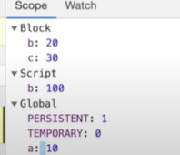

# Basics

>- ***[Execution context & call stack](https://www.youtube.com/watch?v=iLWTnMzWtj4)***
>- ***[Hositing](https://www.youtube.com/watch?v=Fnlnw8uY6jo)***
>- ***[How function work in JS](https://www.youtube.com/watch?v=gSDncyuGw0s)***
>- ***[scope chain & lexical enviroment](https://www.youtube.com/watch?v=uH-tVP8MUs8)***
>- ***[Let & const](https://www.youtube.com/watch?v=BNC6slYCj50)***

# undefined & not defined
>- ***javascript engine will skim through entire code even before execution and allocation memeory to vairable with value undefined***
>- ***javascript is loosely typed language, it means let say u have a varibale x of type string , you can replace it with number or anything***

                    console.log(x) // Reference  error x is not defined
                    let x;
                    console.log(x)  // undefined

# Block scope

***What is block**
>- ***Block is defined by {} , this allows javascript to group statements***
>- ***if(true) console.log("hello") --> if condition is true it can only execute single statement***
>- ***What if to execute multiple statements , yes we use blocks***

                            if(true){
                                console.log("hello1);
                                console.log("hello2);
                                .
                                .
                                .
                            }

***What all variables we can access inside this block***
>- ***In the below example let & const are stored in block scope and var is store in global scope***
>- ***console statement outside block cant access b and c values because , there were declared in block***
>- ***But var a is accessible out the block, thats the reasons , let and const are block scope***

            {
                var a =10;
                let b=20;
                const c=30;
                console.log(a);
                console.log(b);
                console.log(c);
            }
                console.log(a);
                console.log(b);
                console.log(c);
    
     //output will  be it will print  10,20,30,10  and then throws refernce Error : b is not defined

***What is shadowing***

>- ***variable a outside the block and inside the block both are referenced to global scope thats why value of replaced inside the block***
>- ***But when coming to let and const it can be different***
>- ***b which is declared outside  and inside are refrenced to different scopes***
>- ***This behaviour is same in functions as well***
>- ***var is function scope***

            var a =100;
            let b =100;
            {
                var a =10;
                let b=20;
                console.log(a) // it will print 10 , because its shadow or replace value of a with 10
                console.log(b) // it will print 20
            }
            console.log(a) // It will print 10
            console.log(b) // It will print 100
        

# Closures

