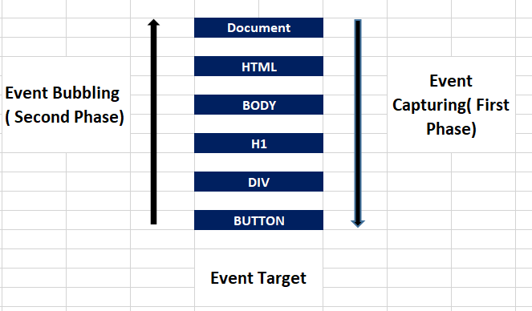

# Hoc

>-  ***A Function which takes another function as an argument and return a function is Higher Order Function***

        const radius =[3,1,2,4];

        const area = (radius) => Math.PI * radius * radius;

        const circumference = (radius) => 2*Math.PI*radius;

        const diameter = (radius) => 2*radius;

        const  calculateLogic = (radius,logic) => {
            const output=[];
            for(let i=0 ; i<radius.length ; i++){
                output.push(logic(radius[i]));
            }

            return output;
        }

        console.log(calculateLogic(radius,area));
        console.log(calculateLogic(radius,circumference));
        console.log(calculateLogic(radius,diameter));

# Event Bubbling & Capturing

>- ***Events are generally processed in three phases - capturing , target , bubbling***
>- ***Capturing phase : This phase trickles down from the top of the DOM tree to the target element.***
>- ***Target Phase : This phase is basically the end of the capturing and the beginning of the bubbling phase***
>- ***Bubbling Phase : The bubbling phase, which is the last phase, is the reverse of the capturing phase.In this phase, the event bubbles up the target element through its parent element, the ancestor, to the global window object.***
>- ***By default all event you add will be attaches to bubbling phase only***
>- ***addEventListener takes three arguments event name , callback function and iscapture(optional)***
>- ***Bydefault the addEvenListener function attaches every event in bubble phase and no need passing isCapture options***
>- ***If you want to captur events in capture phase you need pass isCapture argument as true***

            <!DOCTYPE html>
                <head>
                <title>Akshay Saini</title>

                
                </head>
                <body>

                

                    

                    

                    

                

                
                </body>
            </html>

            document.querySelector("#grandparent")
            .addEventListener('click', (e) => {
                console.log("Grandparent Clicked!");
                //e.stopPropagation();
            }, true);               // Is capture phase enable

            document.querySelector("#parent")
            .addEventListener('click', (e) => {
                console.log("Parent Clicked!");
            }, true);               // Is capture phase enable

            document.querySelector("#child")
            .addEventListener('click', (e) => {
                console.log("Child Clicked!");
            }, true);               // Is capture phase enable

# Event Delegation 
>- ***It is a technique od handling event in a webpage in a better way***
>- ***This is only possible only because event propagate throught out the hierarchy***

>- ***Lte say in amazon  site you can see lot of product display in card formats .do you think event is attached to each and every product card***
>- ***No it will cause of lot of perfomance issue and events are heavy***
>- ***So we take advantage of event propagation and use it to our cause***
>- ***[code example](https://codepen.io/akshaymarch7/pen/omOevJ)

            <!DOCTYPE html>
                <head>
                <title>Akshay Saini</title>
                </head>
                <body>

                

                    <ul id="category">
                        <li id="laptops">laptops</li>
                        <li id="cameras">cameras</li>
                        <li id="shoes">shoes</li>
                    </ul>
                

                
                </body>
            </html>

            <!-- Here we have attached at event to parent of list of card instead of each card and capturing event in the parents -->
            document.querySelector("#category").addEventListener('click', (e) => {
            console.log(e.target);
            if (e.target.tagName == 'LI') {
                window.location.href = "/" + e.target.id;
            }
            });

# Debounce

>- ***It is mainly used for performance optimization when user interacting with the applications***

>- ***Amazon has serach bar to find its products , if you observe the it wont give suggestion on keypress***
>- ***It will only fire event whenever you stop for sometime***
>- ***let say if type computer in search bar , it wont fire event for 8 times , it may be fire for 2 event based on ur typing speed***
>- ***Due to this it control the api hits  and will decrease the load on API***

                    // So when ever you type input the event will fire only after 300 miilli second 
                    let counter = 0;
                    const getData = () => {
                    // calls an API and gets Data
                    console.log("Fetching Data ..", counter++);
                    }

                    const debounce = function (fn, d) {
                    let timer;
                    return function () {
                        let context = this,
                        args = arguments;
                        clearTimeout(timer);
                        timer = setTimeout(() => {
                        getData.apply(context, arguments);
                        }, d);
                    }
                    }

                    const betterFunction = debounce(getData, 300);

                <input type="text" onkeyup= betterFunction() />

# Throttling
>- ***Throttling means controlling the speed of firing events***

>- ***It means let say you have set throttle for 500 millisecond on click event for button***
>- ***How many time you click the button it will only fire one event in that 500 millisecond window***

                const loggerFunc = () => {
                console.count("Throttled Function");
                }

                const throttle = (fn, limit) => {
                let flag = true;
                return function(){
                    let context = this;
                    let args = arguments;
                    if(flag){
                        fn.apply(context, args);
                        flag = false;
                        setTimeout(() => {
                            flag=true;
                        }, limit);
                    }
                }
                }

                const betterLoggerFunction = throttle(loggerFunc, 1000);

                window.addEventListener("resize",betterLoggerFunction);

                // This is the normal Function without Throttling
                //Check the console for the difference between the calls of Normal Function and the Throttled Function 
                
                const normalFunc = () => {
                console.count("Normal Function");
                }

                window.addEventListener("resize",normalFunc);

