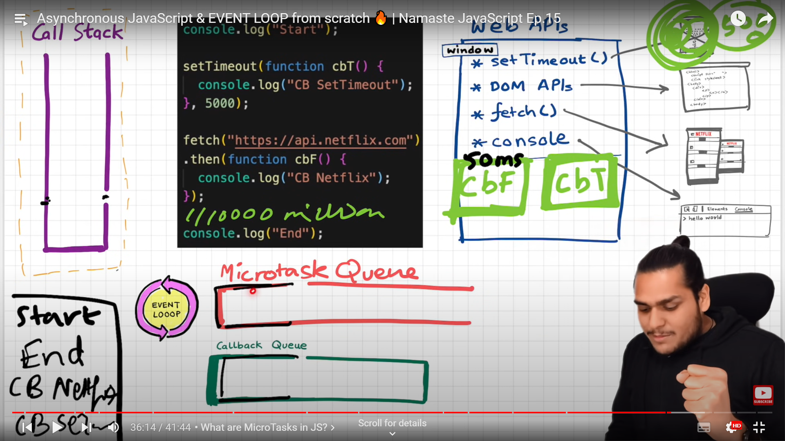

# Asynchronous javascript

## Callback hell

>- ***while using callback we keep on calling back the dependcy in the function in nested manner , this creates call back hell and its very diffcult maintain and read the code***


## Inversion of control

>- ***While using callbacks we are providing access to our function to another function . Which leads to security issue***

***Example***

```javascript
        function creatOrder (    function payment() {
            console.log("Paying for the ordered items)
        }
        ) {
            console.log("creating an order)
            payment();  // we gave control of payment method to createOrder - this is dangerous
        }
```
    
## promises

>-  ***The Promise object represents the eventual completion (or failure) of an asynchronous operation and its resulting value.***
>-  ***Promise object contains two main properties , state & result***
>-  ***A Promise is in one of these states:***
>       - pending: initial state, neither fulfilled nor rejected.
>       - fulfilled: meaning that the operation was completed successfully.
>       - rejected: meaning that the operation failed.
        
>-  ***Promises objects are immmutable , so we can pass wherever you want***

***Promise chaining***
>- ***when you are trying to chain promises please remember return function***


***creating of promise and using it***
```javascript
        const cart = ["shoes","pants"];
        
        <!-- creating a promise -->
        function createOrder(cart) {
            const pr = new Promise((resolve,reject) => {
                //for returing success
                if(cart.length===0) reject("cart is not valid");
                else resolve("orderID:1111");
            })
            return pr;
        }

        function proceedToPayment() {
            return  new Promise((resolve,reject) => {
                resolve("payment is successful");
            })
        }
        
        <!-- using a promise -->

        const promise = createOrder(cart);

        <!-- normal functions -->
        promise
        .then(function(orderId) {
            console.log(orderId);
            return orderId;
        })
        .then(function(orderId){
            return proceedToPayment(orderId)
        })
        .then(function(paymentInfo){
            console.log(paymentInfo)
        });
        .catch((error) => console.log(error.message));

        <!-- arrow functions -->
        promise
        .then((orderId) => orderId)
        .then((orderId) => proceedToPayment(orderId))
        .then((paymentInfo) => console.log(""paymentInfo"));
        .catch((error) => console.log(error.message));

```

## Async & Await

***What is Async function***

>-  Async function always return promise whether you return a promise or not
>-  If you return a promise if will return as it is.
>-  Await can only be used inside async function.

***Example***
    <!-- Even if you return string , it returns promise wraps aroud it. -->
```javascript
    const aysnFunction = async () => {return "hello"}

    <!-- using of await  -->

    const p = new Promise((resolve,reject) => {
        resolve("promise is resolved");
    })

    const handlePromise = async () => {
        const data = await p;
        console.log(data);
    }
    handlePromise();
```

## Difference between handling Promises using traditional & aysnc,await

>-  ***when handling promises in tradition way , JS engine wont wait until promise get to resolve***
>-  ***When handling promises using asyn& wait , JS engine will remove the respective fuction from call stack ,and put it back once promise is resolved - So this process will make you feel like JS engine is waiting***
>-  ***When we use promises the call back function will store in priority queue***


***Two Promises were created  with setTimeOut for having delay Effect***
```javascript
             const p1 = new Promise((resolve,reject) => {
                //resolving promise after 10 seconds
                setTimeout(() => {
                    resolve("promise is resolved");
                },5000);
            })

            const p2 = new Promise((resolve,reject) => {
                //resolving promise after 10 seconds
                setTimeout(() => {
                    resolve("promise is resolved");
                },10000);
            })
```

***JS Engines work when using async& await  handling multple promises***
>    - ***When we have multiple Promise the both the will start resolving parelley before JS engine***
>    - ***When JsEngine comes to  line await p1 ,it will where p1 is resolved or not***
>    - ***if it not resolved , it will suspend the current Execution context(HandleMultiplePromise) from callStack***
>    - ***It will do exectue some other code in meanwhile***
>    - ***Once this p1 is resolved it will JS engine to insert it to callstack***
>    - ***JS engine again start from line where it stopped and check promise resolved and move to next line***
>    - ***It will some to next line of promise await p2 check whther its resolved or not , If its not resolved ,again execution context is removed from call stack***
>    - ***the above process happens again***


***let say you have multiple promises resolving  p1 (took 5 sec), p2 (took 10 sec) (when using sync await)***
>- ***promises are logged  paralley to WEB API environment to get it resolved***
>- ***Hello will printed***
>- ***suspense the executon context from call stack for 5 sec***
>- ***Once promise resolved. JS engine will get it back to callstack and  executet from the point where it left***
>- ***It print namstey javascript1***
>- ***check if promise is resolved or not still have 5 sec remains for second promise to resolves***
>- ***suspense the executon context from call stack ***
>- ***Once promise resolved. JS engine will get it back to callstack and  executet from the point where it left***
>- ***It will print namstey Javascript2***

    

 ***let say you have multiple promises resolving  p1 (took 10 sec), p2 (took 5 sec) (when using sync await)***
>- ***promises are logged  paralley to WEB API environment to get it resolved***
>- ***Hello will printed***
>- ***suspense the executon context from call stack for 10 sec***
>- ***Once promise resolved. JS engine will get it back to callstack and  executet from the point where it left***
>- ***It print namstey javascript1***
>- ***check if promise is resolved or not . Its already resolved as p2 is having timeout of 5 seconds***
>- ***It will print namstey Javascript2 immedieatly***

```javascript
                  const handleMultiplePromise = async () => {
                    console.log("Hello") // Its will print this line 
                    const data1 = await p1; 
                    console.log("namstey Javascript1");

                    const data2 = await p2; 
                    console.log("namstey Javascript2");

                }
        
              handleMultiplePromise();
```


## handling in traditionl way
>- ***It wont suspend the Execution Context , it goes on and print what ever it comes it way once.***
>- ***Once whole code is executed the removes from the callstack***
>- ***Once the callstack resolved respective call back method will comes to the call stack***
>- ***This process is similar to Eventloop video of namstey javascript***

```javascript
        function getData(){
            p1.then((res) => console.log(res));
            console.log("namstey Javascript1");

            p2.then((res) => console.log(res));
            console.log("namstey Javascript"2);
        }
```





## Fetch method  and Error Handling using Async
```javascript
    const getData = async () => {
        try{
        const resp = await fetch("API_URL");
        const data = await resp.json();

        console.log(data);
        }
        catch(err){
            console.log("Error",err);
        }
    }
```
    getData();


 ##  parallel Fetch method  and Error Handling using Async
```javascript
const urls = [
  'https://api.example.com/data1',
  'https://api.example.com/data2',
  'https://api.example.com/data3',
];

// Function to fetch data from all URLs in parallel
const fetchAllData = async () => {
  try {
    // Create an array of fetch promises
    const fetchPromises = urls.map(url => fetch(url).then(response => response.json()));

    // Wait for all fetch promises to resolve
    const results = await Promise.all(fetchPromises);

    // Log the results
    console.log(results);
  } catch (error) {
    console.error('Error fetching data:', error);
  }
};

// Call the function to fetch data
fetchAllData();
```

